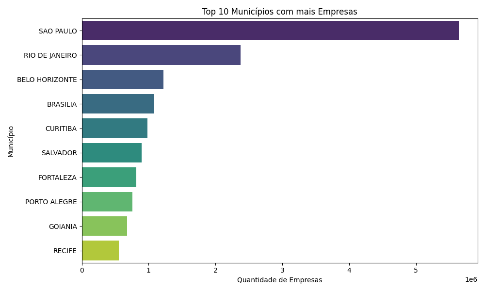
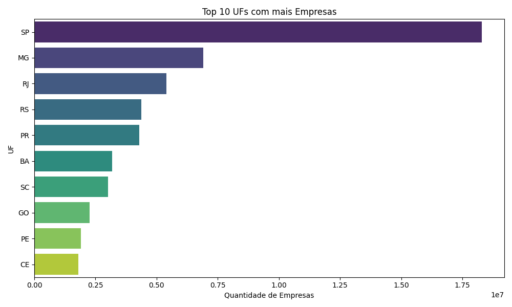
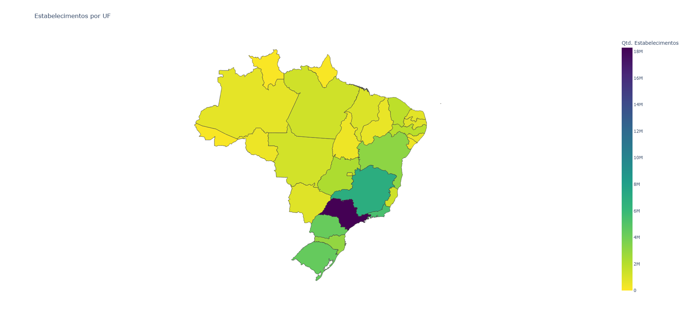
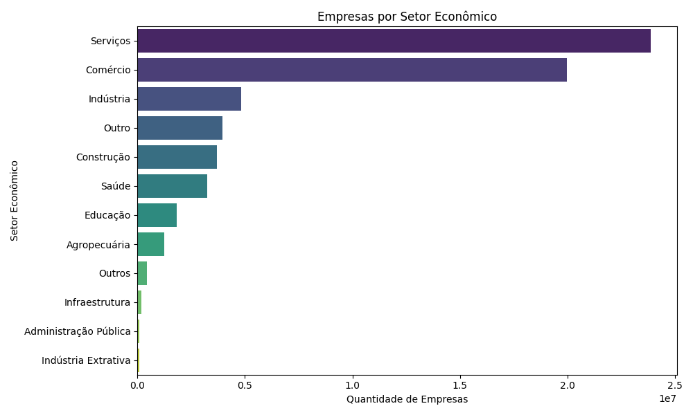
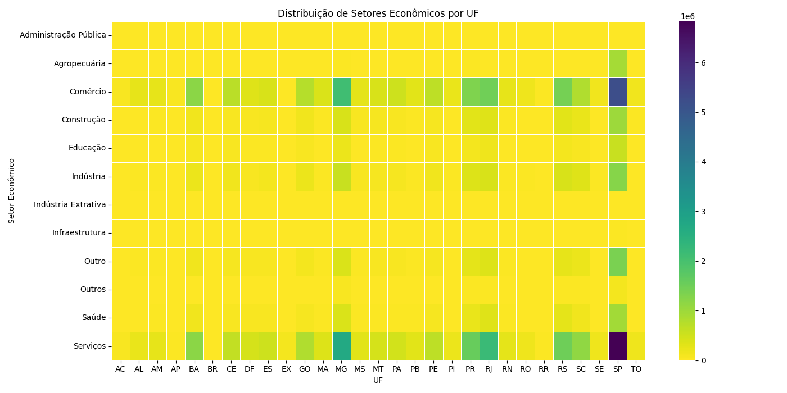

# Dados Abertos CNPJ – Dicionário de Campos

Este projeto utiliza dados abertos do CNPJ para análise de estabelecimentos empresariais no Brasil.

## Análise Visual dos Resultados

### 1. Top 10 Municípios com mais Empresas

  

**Descrição:** Este gráfico de barras apresenta os 10 municípios brasileiros com maior número de empresas registradas. 

**Resultado:** Observa-se forte concentração em grandes capitais e polos econômicos, indicando centralização das atividades empresariais em regiões metropolitanas.

### 2. Top 10 UFs com mais Empresas

  

**Descrição:** Gráfico de barras com as 10 Unidades Federativas (estados) que concentram o maior número de empresas.

**Resultado:** Os estados de São Paulo, Minas Gerais e Rio de Janeiro lideram, refletindo o peso econômico dessas regiões no cenário nacional.

### 3. Estabelecimentos por UF (Mapa Coroplético)

  

**Descrição:** Mapa coroplético do Brasil, onde a cor indica a quantidade de estabelecimentos por estado.

**Resultado:** A distribuição reforça a concentração de empresas no Sudeste, Sul e algumas áreas do Nordeste.

### 4. Empresas por Setor Econômico

  

**Descrição:** Gráfico de barras mostrando a quantidade de empresas por setor econômico.

**Resultado:** O setor de Serviços é o mais representativo, seguido por Comércio e Indústria, evidenciando a predominância do setor terciário na economia brasileira.

### 5. Distribuição de Setores Econômicos por UF (Mapa de Calor)

  

**Descrição:** Heatmap que mostra a distribuição dos principais setores econômicos em cada estado.

**Resultado:** Permite identificar diferenças regionais, como maior presença da indústria em alguns estados e predominância de serviços em outros.

